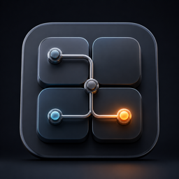

# Gridman

<p align="center">
  
</p>

<p align="center">
  <strong>A workspace-first API client derived from Bruno.</strong>
</p>

<p align="center">
  <a href="https://github.com/shahramgit/gridman/releases"></a>
  <a href="license.md"></a>
  <a href="https://github.com/shahramgit/gridman/issues"></a>
</p>

Gridman is a desktop API client for teams that want API collections to live in ordinary folders and sync through Git. Each workspace is a visible folder, each collection belongs under that workspace's `collections/` directory, and Git operations run at the workspace root.

Gridman is intentionally opinionated: one workspace maps cleanly to one Git repository. This removes hidden default workspaces, external collection links, and the ambiguity that comes from spreading one API workspace across unrelated folders.

## Table of Contents

- [Download](#download)
- [Why Gridman](#why-gridman)
- [Features](#features)
- [Workspace Model](#workspace-model)
- [Git Workflow](#git-workflow)
- [Development](#development)
- [Release Builds](#release-builds)
- [Project Status](#project-status)
- [Attribution](#attribution)
- [License](#license)

## Download

Download the latest Gridman release from [GitHub Releases](https://github.com/shahramgit/gridman/releases).

Choose the asset for your platform:

- macOS Apple Silicon: `arm64_mac.dmg`
- macOS Intel: `x64_mac.dmg`
- Windows ARM64: `arm64_win.exe`
- Windows x64: `x64_win.exe`
- Linux ARM64: `arm64_linux.AppImage`
- Linux x64: `x86_64_linux.AppImage`

### macOS Note

Current macOS builds are unsigned. If macOS blocks the app after installing it, remove the quarantine flag:

```sh
sudo xattr -dr com.apple.quarantine "/Applications/Gridman.app"
```

### Linux Note

Make the AppImage executable before running it:

```sh
chmod +x gridman_<version>_x86_64_linux.AppImage
./gridman_<version>_x86_64_linux.AppImage
```

## Why Gridman

- Workspace-owned collections: every collection lives inside its workspace folder.
- Git-first collaboration: commit, pull, push, and sync at the workspace level.
- Predictable file layout: requests, collections, docs, and workspace metadata are plain files.
- No hidden default workspace: first launch creates a normal workspace under `~/Documents/gridman`.
- No external collection linking: imported collections are copied into the active workspace.
- Offline-first desktop app: your API data stays on your machine unless you push it to a Git remote.

## Features

### API Client

- HTTP request editing and execution
- Headers, params, auth, body, variables, scripts, and tests
- Response viewing with headers, body, cookies, timeline, and request metadata
- cURL import for quickly creating requests
- File-based request and collection storage

### Workspace-Level Git

- Initialize Git from the workspace
- Set or change a remote origin
- Refresh, fetch, pull, push, and sync committed changes
- Stage files and commit from the Git tab
- Detect changed, staged, unstaged, and orphaned workspace files
- Keep local environment files out of normal Git commits by default

### Data Inspection

- Preview embedded `data:image/...` values
- Right-click selected text to inspect Base64 and image payloads
- Copy original, decoded, or re-encoded selected data
- Replace editable selections with decoded or encoded values

## Workspace Model

Gridman intentionally uses a strict workspace model:

```text
My Workspace/
  workspace.yml
  collections/
    orders-api/
    billing-api/
  docs/
  .git/
```

Rules:

- Workspaces are normal folders, usually under `~/Documents/gridman`.
- Collections must be stored below `<workspace>/collections/`.
- `workspace.yml` stores relative collection paths.
- Creating a collection writes into the active workspace's `collections/` folder.
- Importing or opening a collection copies it into the active workspace.
- Deleting a collection removes the collection folder from disk.

This model keeps Git behavior predictable because the workspace root owns the whole API project.

## Git Workflow

Git is workspace-level only.

Typical flow:

1. Create or open a Gridman workspace.
2. Open the workspace Git tab.
3. Initialize Git or connect an existing remote origin.
4. Create or import collections.
5. Stage changes, write a commit message, and commit.
6. Pull before pushing when collaborating with others.
7. Push committed changes to the remote.

Gridman excludes local environment files from normal Git commits by default because they may contain secrets, passwords, tokens, or machine-specific values.

## Development

Install dependencies:

```sh
npm run setup
```

Run the desktop development app:

```sh
npm run dev
```

Build the renderer:

```sh
npm run build:web
```

Build desktop packages:

```sh
npm run build:electron:mac
npm run build:electron:win
npm run build:electron:linux
```

Platform builds use Electron Builder. Cross-platform packaging can require platform-specific tools such as signing certificates, Wine, or native Git.

## Release Builds

Maintainer release notes and upload instructions are documented in [docs/github-release.md](docs/github-release.md).

The short version:

```sh
scripts/github-release.sh v3.3.0-vasl.2
scripts/github-release.sh v3.3.0-vasl.2 --upload
```

## Project Status

Gridman is a new fork and rebrand of Bruno. The codebase is actively diverging around a stricter workspace model and workspace-level Git workflows.

Use development builds carefully and keep backups of important workspaces while the project stabilizes.

## Contributing

Issues and pull requests are welcome at [github.com/shahramgit/gridman](https://github.com/shahramgit/gridman).

Before larger changes, open an issue describing the workflow, expected behavior, and any compatibility concerns with existing Gridman workspaces.

## Attribution

Gridman includes code derived from [Bruno](https://github.com/usebruno/bruno), originally created by Anoop M D, Anusree P S, and contributors. Bruno is distributed under the MIT License.

The Bruno name is a trademark of its owner. Gridman is an independent fork and is not affiliated with or endorsed by the Bruno project.

See [NOTICE.md](NOTICE.md) and [license.md](license.md) for attribution and license details.

## License

Gridman is distributed under the MIT License. See [license.md](license.md).
